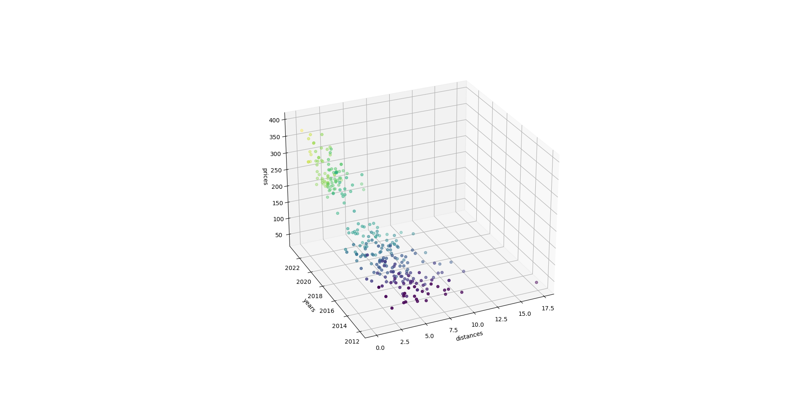

# Web-Scraping-and-Visualization-of-Audi-A1-Sportback-Car-Data-from-Goo-net.com

##English
This is a web scraping project that collects car data from the goo-net.com website, specifically focusing on Audi A1 Sportback models. It fetches data such as manufacturing year, distance traveled, and price from multiple pages of the site. Once the data is collected, it is visualized using a 3D scatter plot with the matplotlib library. The axes represent distance, year, and price.This project was mainly developed with the help of ChatGPT by OpenAI. Special thanks to OpenAI for providing such a powerful AI language model, which greatly facilitated the development process.

##中文
这是一个网络爬虫项目，从 goo-net.com 网站上收集汽车数据，特别关注奥迪 A1 Sportback 车型。它从站点的多个页面获取数据，如制造年份、行驶距离和价格。数据收集完成后，使用 matplotlib 库将其可视化为一个 3D 散点图。图中的轴分别表示行驶距离、年份和价格。本项目主要在 ChatGPT（由 OpenAI 开发）的帮助下完成。特别感谢 OpenAI 提供了如此强大的人工智能语言模型，这极大地促进了开发过程。

##日本語
これは、goo-net.com ウェブサイトから車のデータを収集するウェブスクレイピングプロジェクトで、特に Audi A1 Sportback モデルに焦点を当てています。サイトの複数のページから、製造年、走行##距離、価格などのデータを取得します。データが収集されると、matplotlib ライブラリを使用して 3D 散布図で可視化されます。軸は、距離、年、および価格を表します。このプロジェクトは、OpenAI による ChatGPT の助けを借りて主に開発されました。開発プロセスを大幅に促進したこの強力な AI 言語モデルを提供してくれた OpenAI に感謝します。

